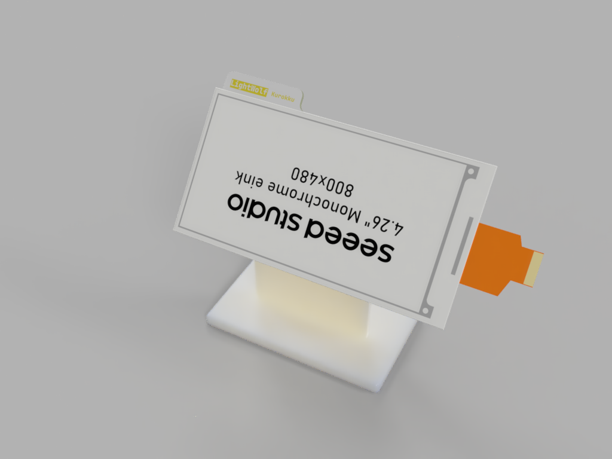

# Kurokku

Kurokku is an ESP32 based Wi-Fi smart clock. Featuring E-ink display, it can pull weather data, calendar and display realtime clock. It is designed to be a simple and elegant clock that can be placed on a desk. There's also a SHT40 temperature and humidity sensor to provide more information.

Case was not designed and it's intended to just directly use screw as stand.

> [!NOTE]
> Please don't expect me to find a 3D model for e-ink display and include it.

> Note that display is not here yet because it's going to order seperately.

## Schematic

## Routing

## BOM

| Name | Qty | Total (USD) | Distributor |
| --- | --- | --- | --- |
| [Waveshare e-ink display](https://detail.tmall.com/item.htm?from=cart&id=763853854896&mi_id=0000evqKCP1iKHChQN8zlU8k7eiaN9Pw3tzSlfQsYnoQPNw&skuId=5256424296363&upStreamPrice=13068) | 1 | 19.50 | Taobao |
| [Seeed Xiao ESP32-S3](https://item.taobao.com/item.htm?from=cart&id=717378181472&mi_id=0000sOOkvg8oup2ws_yxejnEZ-Q6HdgFkvkQyJaaRKFnI_o&upStreamPrice=5500) | 1 | 8.20 | Taobao |
| PCB & PCBA | 1 | 28.96 | JLCPCB |
| Shipping | 1 | 0.5 | Taobao |
| Total | - | 57.16 | - | 
